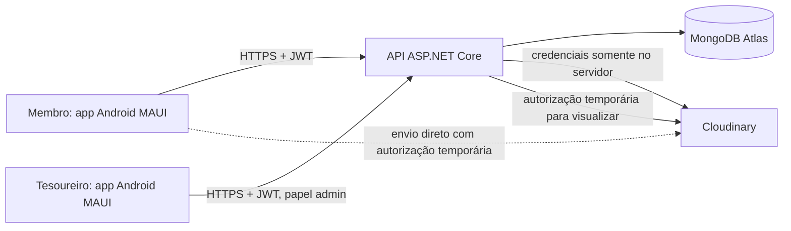

# Gerência da Tesouraria da Igreja — Arquitetura da Solução

**Versão:** 1.0  
**Data:** 28 de setembro de 2026  
**Estado:** proposta inicial para orientar a implementação

## 1. Objetivo

Este documento descreve uma solução para registrar contribuições mensais dos membros, receber comprovantes, acompanhar pendências e permitir que o tesoureiro revise os pagamentos e gerencie as contribuições previstas para cada pessoa.

O primeiro cliente será um aplicativo Android feito em C# .NET MAUI e XAML. Os dados estruturados ficarão no MongoDB, e os arquivos de comprovante serão armazenados na Cloudinary. A proposta inclui uma API própria entre o aplicativo e esses serviços para aplicar regras de negócio e proteger credenciais e dados.

## 2. Situação atual do repositório

O projeto existente é um aplicativo .NET MAUI chamado `Gerencia_AMA`, com alvo Android em `net10.0-android`. O `MainPage.xaml` ainda é a tela de demonstração do template, e o projeto não contém telas ou integrações de negócio, API, modelos de domínio ou acesso a dados. O arquivo de projeto também deixa alvos para iOS, Mac Catalyst e Windows conforme o sistema de compilação.

Assim, a implementação deve começar substituindo a tela de exemplo e organizando o cliente MAUI, ao mesmo tempo que cria uma API ASP.NET Core separada. O Android é a plataforma inicial; manter a interface em MAUI facilita considerar outras plataformas depois.

## 3. Escopo funcional

### Membro

- Entrar com usuário e senha provisionados pelo administrador do sistema.
- Ver as contribuições atribuídas a si e as parcelas mensais correspondentes.
- Distinguir parcelas futuras, a vencer, vencidas, aguardando revisão, aprovadas e rejeitadas.
- Enviar uma imagem ou PDF como comprovante de uma parcela.
- Consultar o histórico mensal e abrir os comprovantes enviados, desde que tenha acesso à parcela.
- Ver o motivo de uma rejeição e enviar um novo comprovante.

### Tesoureiro

- Consultar e pesquisar os membros, o perfil e o histórico financeiro de cada um.
- Criar tipos de contribuição, como “ASA” ou “Ministério Jovem”.
- Atribuir uma contribuição a um membro ou a vários membros, com valor, período, vencimento e observações.
- Acompanhar parcelas pendentes, comprovantes enviados e parcelas em atraso.
- Abrir comprovantes, aprovar ou rejeitar pagamentos e registrar o motivo da rejeição.
- Consultar o histórico mensal e os totais por período ou tipo de contribuição.
- Desativar usuários ou encerrar atribuições sem apagar os registros históricos.

### Fora da primeira entrega

- Cadastro público e recuperação automática de senha.
- Processamento ou conciliação automática com bancos e Pix.
- Leitura automática dos comprovantes por OCR.
- Notificações push, exportação contábil e painel web separado.
- Gestão de várias igrejas/organizações em uma mesma instalação.

Esses itens podem ser adicionados depois, sem alterar o princípio de que a API é a autoridade sobre os dados e permissões.

## 4. Arquitetura proposta



### Aplicativo MAUI

Responsável por telas, navegação, validação de formulário, seleção de arquivos com as APIs do MAUI, apresentação de estados e chamadas HTTPS. Deve usar MVVM para separar XAML, estado de tela e serviços HTTP. Um único aplicativo pode mostrar a navegação de membro ou de tesoureiro de acordo com as permissões devolvidas pela API; esconder uma opção na interface não substitui a verificação de autorização no servidor.

### API ASP.NET Core

Responsável por autenticação, autorização, regras de negócio, criação das parcelas, validação de comprovantes, consultas, auditoria e comunicação segura com MongoDB e Cloudinary. É também o único componente com acesso à string de conexão do MongoDB e ao segredo da Cloudinary.

### MongoDB

Guarda usuários, tipos de contribuição, atribuições, parcelas mensais, referências dos arquivos e trilha de auditoria. MongoDB Atlas é uma opção gerenciada para reduzir trabalho operacional. A aplicação usa o driver oficial C# e índices definidos para as consultas reais.

### Cloudinary

Guarda os bytes dos comprovantes; o MongoDB guarda metadados e referências, não o arquivo em si. Os comprovantes devem ter acesso restrito. A API pode gerar uma assinatura de upload de curta duração para o app enviar o arquivo diretamente à Cloudinary, e assinar URLs de visualização de curta duração depois de verificar o acesso. Nunca incluir o `api_secret` no aplicativo. A documentação da Cloudinary descreve uploads autenticados e tipos de entrega `private` e `authenticated` ([upload API](https://cloudinary.com/documentation/image_upload_api_reference), [controle de acesso a mídias](https://cloudinary.com/documentation/control_access_to_media)).

## 5. Tecnologias

| Área | Tecnologia proposta | Uso |
|---|---|---|
| Aplicativo | C# .NET MAUI + XAML, .NET 10 | Android primeiro, com possibilidade de outros alvos já previstos no projeto |
| Padrão da interface | MVVM + `CommunityToolkit.Mvvm` | ViewModels, comandos, validação e estado das telas |
| Seleção de comprovante | `FilePicker` do MAUI | Selecionar imagem/PDF, com filtros e limite de tamanho |
| Comunicação | `HttpClient` + JSON/REST sobre HTTPS | Consumo da API |
| API | ASP.NET Core Web API em .NET 10 | Autenticação, autorização e regras da aplicação |
| Banco | MongoDB Atlas + MongoDB.Driver para C# | Dados operacionais e consultas |
| Arquivos | Cloudinary .NET SDK no servidor ou REST autenticada | Upload restrito, assinatura de upload e URL temporária de visualização |
| Autenticação | Senhas com hash adaptativo + tokens de acesso JWT e renovação revogável | Sessão autenticada e autorização por papel |
| Hospedagem | Serviço gerenciado para API, com TLS e segredos em variáveis/secret manager | Disponibilizar API sem expor serviços internos |
| Logs | Logging estruturado sem conteúdo de comprovantes ou credenciais | Diagnóstico e auditoria operacional |

O Community Toolkit fornece componentes reutilizáveis para MAUI ([documentação](https://learn.microsoft.com/dotnet/communitytoolkit/maui/)). O driver C# oficial documenta conexão e criação de índices ([conexão](https://www.mongodb.com/docs/drivers/csharp/current/connect/connection-targets/), [índices](https://www.mongodb.com/docs/drivers/csharp/current/indexes/)).

## 6. Organização do código

Uma solução com dois projetos principais mantém a interface e o servidor independentes:

```text
Gerencia_AMA.sln
├── src/
│   ├── Gerencia_AMA.App/                 # MAUI existente
│   │   ├── Views/                        # páginas XAML
│   │   ├── ViewModels/
│   │   ├── Models/                       # modelos de tela/DTOs
│   │   ├── Services/                     # cliente HTTP, sessão, arquivos
│   │   └── Resources/
│   ├── Gerencia_AMA.Api/                 # ASP.NET Core Web API
│   │   ├── Controllers/ ou Endpoints/
│   │   ├── Application/                  # casos de uso e regras
│   │   ├── Domain/                       # entidades e estados
│   │   ├── Infrastructure/               # MongoDB, Cloudinary, tokens
│   │   └── Contracts/                    # DTOs e validação de entrada
│   └── Gerencia_AMA.Shared/              # contratos simples compartilhados, se útil
└── docs/
```

Evitar compartilhar entidades persistidas diretamente com o aplicativo. A API deve devolver DTOs com apenas os campos necessários e sem segredos internos, como hashes de senha, conexão ou campos administrativos.

## 7. Modelo de dados MongoDB

Usar identificadores `ObjectId` ou UUID consistentes. Datas persistidas em UTC; valores financeiros em decimal exato (`Decimal128`) ou inteiro em centavos. Nunca usar ponto flutuante binário para valores monetários. A exibição usa `pt-BR` e fuso horário configurado para a igreja.

### `users`

```json
{
  "_id": "ObjectId",
  "fullName": "Billy Silva",
  "username": "billy",
  "passwordHash": "hash gerado no servidor",
  "role": "member",
  "status": "active",
  "createdAt": "UTC",
  "updatedAt": "UTC",
  "lastLoginAt": "UTC ou null"
}
```

Papéis iniciais: `member` e `treasurer`. O nome de usuário deve ser único sem diferença de maiúsculas/minúsculas. Não armazenar senha em texto puro.

### `contributionTypes`

```json
{
  "_id": "ObjectId",
  "name": "Ministério Jovem",
  "description": "Contribuição para as atividades do ministério",
  "active": true,
  "createdAt": "UTC",
  "createdBy": "userId"
}
```

O tipo descreve a categoria; valor e duração são definidos na atribuição. Desativar um tipo impede novas atribuições, sem apagar as existentes.

### `memberAssignments`

Representa a atribuição de um tipo de contribuição a um membro. É a regra que origina as parcelas, por exemplo, 30 reais por mês de setembro a novembro.

```json
{
  "_id": "ObjectId",
  "memberId": "userId",
  "contributionTypeId": "typeId",
  "amount": { "$numberDecimal": "30.00" },
  "currency": "BRL",
  "startMonth": "2026-09",
  "endMonth": "2026-11",
  "dueDay": 10,
  "status": "active",
  "notes": "Aprovado em reunião de ...",
  "createdBy": "treasurerUserId",
  "createdAt": "UTC",
  "endedAt": null
}
```

Editar valor ou período no futuro não deve reescrever parcelas já geradas nem mudar o histórico. Encerra-se ou versiona-se a atribuição e cria-se outra. O vencimento usa dia 1 a 28, ou uma política explícita para fim do mês, evitando datas inexistentes em fevereiro.

### `monthlyObligations`

Um documento por membro, atribuição e mês. Essa parcela materializada preserva o valor e o vencimento que valiam naquele mês, mesmo que a atribuição seja alterada mais tarde.

```json
{
  "_id": "ObjectId",
  "memberId": "userId",
  "assignmentId": "assignmentId",
  "contributionTypeId": "typeId",
  "period": "2026-09",
  "amount": { "$numberDecimal": "30.00" },
  "currency": "BRL",
  "dueAt": "2026-09-10T23:59:59Z",
  "status": "awaiting_payment",
  "submission": null,
  "review": null,
  "createdAt": "UTC",
  "updatedAt": "UTC"
}
```

Estados propostos: `upcoming`, `awaiting_payment`, `overdue`, `under_review`, `approved`, `rejected`, `cancelled`. Pode-se obter o estado de vencimento dinamicamente a partir de `dueAt` e dos dados de envio; se armazenado para consulta rápida, uma rotina deve atualizá-lo de modo consistente. Submissão e revisão devem ter transições validadas no servidor.

Dentro de `submission`, guardar a tentativa atual e, quando necessário, uma lista limitada ou coleção separada de tentativas anteriores:

```json
{
  "uploadedAt": "UTC",
  "originalFileName": "comprovante-setembro.pdf",
  "resourceType": "raw",
  "format": "pdf",
  "bytes": 245123,
  "cloudinaryAssetId": "...",
  "cloudinaryPublicId": "receipts/obligation-id/random-id",
  "deliveryType": "authenticated"
}
```

Não guardar uma URL pública ou uma URL assinada permanente. O servidor recupera ou assina um endereço de visualização de curta duração após autorizar o usuário. O objeto `review` registra `reviewedBy`, `reviewedAt`, `decision` e `rejectionReason`.

### `auditLogs`

Registra ações que alteram dados ou permissões: atribuição criada/encerrada, comprovante enviado, parcela aprovada/rejeitada, usuário desativado e credencial redefinida. Campos mínimos: `actorUserId`, `action`, `targetType`, `targetId`, `occurredAt`, `metadata` permitida. Não registrar senha, token, conteúdo de comprovante ou URL assinada.

### Índices iniciais

- `users`: índice único em `username` normalizado.
- `memberAssignments`: `{ memberId: 1, status: 1 }` e `{ contributionTypeId: 1, status: 1 }`.
- `monthlyObligations`: índice único `{ memberId: 1, assignmentId: 1, period: 1 }` para impedir parcelas duplicadas; consultas por `{ memberId: 1, period: -1 }`, `{ status: 1, dueAt: 1 }` e `{ contributionTypeId: 1, period: 1 }`.
- `auditLogs`: `{ targetType: 1, targetId: 1, occurredAt: -1 }` e `{ actorUserId: 1, occurredAt: -1 }`.

Índices devem ser confirmados pela forma das consultas; índices adicionais aumentam o custo de escrita e armazenamento. A documentação oficial explica que sem índice o MongoDB pode examinar documentos não correspondentes ([índices no driver C#](https://www.mongodb.com/docs/drivers/csharp/current/indexes/)).

## 8. Regras de negócio e ciclo mensal

1. O tesoureiro cria um tipo de contribuição ou seleciona um ativo.
2. O tesoureiro cria a atribuição ao membro com valor, mês inicial/final e vencimento.
3. A API cria uma parcela mensal por período, usando chave única para evitar duplicação em reprocessamentos.
4. O membro vê parcelas futuras e a situação das parcelas do mês e anteriores.
5. Para pagar, seleciona uma parcela em aberto e envia JPG, PNG ou PDF dentro do limite definido.
6. A API valida que a parcela pertence ao membro autenticado e ainda aceita comprovante. Após o upload, associa o recurso da Cloudinary e muda a situação para `under_review`.
7. O tesoureiro abre a fila de revisão, confere comprovante, membro, tipo, mês e valor; então aprova ou rejeita com justificativa.
8. A aprovação fecha a parcela como `approved`. A rejeição libera novo envio e mantém o motivo e trilha da tentativa anterior.

O comprovante enviado não quita automaticamente a parcela. “Enviado” e “aprovado” são situações diferentes; isso evita indicar quitação antes da conferência do tesoureiro. Se a igreja optar por considerar apenas o envio como suficiente, essa política deve ser explícita, pois muda o significado dos estados e relatórios.

### Determinação de pendência

Configurar dia de vencimento e fuso da igreja. Antes do vencimento: `awaiting_payment` ou `upcoming`. Depois do vencimento, sem comprovante aguardando análise: `overdue`. Com comprovante em análise: `under_review`, visível separadamente na fila do tesoureiro. Após aprovação: `approved`. Rejeitado: `rejected`; a parcela volta a ser cobrável e pode receber nova tentativa. Atraso e rejeição devem ser apresentados em termos claros para não confundir pagamento enviado com dívida quitada.

Na ausência de regra institucional de vencimento, o padrão inicial sugerido é vencimento no último dia do mês, configurável por atribuição. O exemplo “setembro a novembro” gera três documentos e não depende de quantos meses se passaram desde o cadastro.

## 9. API proposta

Rotas REST versionadas sob `/api/v1`. A API exige HTTPS e token válido em todas as rotas privadas.

| Método e rota | Papel | Finalidade |
|---|---|---|
| `POST /auth/login` | Público | Validar credenciais e retornar token de acesso |
| `POST /auth/refresh` | Token de renovação | Renovar sessão e permitir revogação |
| `POST /auth/logout` | Autenticado | Revogar sessão/refresh token |
| `GET /me` | Autenticado | Perfil e permissões da sessão |
| `GET /me/obligations?period=2026-09` | Membro | Parcelas e estados próprios |
| `GET /me/history` | Membro | Histórico próprio paginado |
| `POST /obligations/{id}/upload-authorization` | Membro dono ou tesoureiro | Obter parâmetros temporários para upload |
| `POST /obligations/{id}/submission` | Membro dono ou tesoureiro | Confirmar upload validado e submeter comprovante |
| `GET /obligations/{id}/proof-access` | Membro dono ou tesoureiro | Obter autorização/URL temporária de visualização |
| `GET /admin/members` | Tesoureiro | Listar e filtrar membros |
| `POST /admin/members` | Tesoureiro | Criar membro ou iniciar provisionamento |
| `GET /admin/members/{id}/history` | Tesoureiro | Consultar histórico de um membro |
| `POST /admin/contribution-types` | Tesoureiro | Criar tipo |
| `POST /admin/assignments` | Tesoureiro | Criar atribuição e gerar parcelas |
| `POST /admin/assignments/{id}/end` | Tesoureiro | Encerrar atribuição futura |
| `GET /admin/reviews` | Tesoureiro | Fila de comprovantes a revisar |
| `POST /admin/obligations/{id}/approve` | Tesoureiro | Aprovar parcela |
| `POST /admin/obligations/{id}/reject` | Tesoureiro | Rejeitar com motivo |
| `GET /admin/reports/monthly` | Tesoureiro | Totais por período e tipo |

Respostas paginadas devem limitar resultados. Erros retornam códigos HTTP coerentes e mensagens sem detalhes internos. A API deve validar propriedade da parcela em cada consulta e ação do membro, em vez de confiar num `memberId` enviado pelo cliente.

## 10. Telas principais

### Membro

1. **Login:** usuário e senha; mensagens genéricas para falha de autenticação.
2. **Resumo:** total de parcelas do mês, pendentes, aguardando revisão e aprovadas.
3. **Pendências:** lista por mês e tipo, valor, vencimento, estado e ação “Enviar comprovante”.
4. **Enviar comprovante:** seleção de câmera/galeria/arquivos, nome e tamanho do arquivo, confirmação e acompanhamento de envio.
5. **Histórico:** filtro por ano/mês/tipo e detalhe com estado de revisão.
6. **Detalhe:** parcela, comprovante próprio e motivo da rejeição quando aplicável.

### Tesoureiro

1. **Painel:** quantidade e valor total em atraso, a vencer e aguardando análise.
2. **Membros:** pesquisa, perfil e histórico.
3. **Tipos e atribuições:** criação, edição por encerramento/versionamento e visualização de meses abrangidos.
4. **Revisão:** fila, filtros e visualização segura do arquivo; aprovar ou rejeitar com observação.
5. **Relatórios:** totais por mês e tipo, com possibilidade futura de exportação.

Cada tela deve ter estados de carregamento, vazio, erro e falta de conectividade. Mensagens ao usuário devem evitar expor exceções técnicas.

## 11. Segurança, privacidade e operação

- A comunicação app/API e API/serviços externos usa HTTPS.
- MongoDB e Cloudinary são acessados pelo servidor. A string de conexão, `api_secret`, chave de assinatura JWT e credenciais administrativas ficam em secret manager/variáveis seguras do ambiente, nunca no repositório nem no pacote Android.
- O login inicial pode ser provisionado diretamente no banco, como solicitado, mas deve gravar `passwordHash` gerado pelo servidor; nunca senha em texto puro. Preferencialmente, criar usuários por comando administrativo controlado que aplica hash e registra a operação.
- Tokens de acesso têm duração curta. Tokens de renovação são revogáveis, guardados de forma segura no dispositivo e rotacionados ao renovar. No MAUI, usar armazenamento seguro da plataforma (`SecureStorage`) e limpar a sessão no logout.
- Verificar papel e propriedade de cada recurso no servidor; limitar tentativas de login e registrar eventos de segurança sem registrar segredos.
- Validar extensão, tipo MIME detectado, tamanho e conteúdo do arquivo no servidor/serviço de upload. Definir limite inicial (por exemplo, 10 MB, sujeito a ajuste) e permitir somente formatos necessários. Não confiar apenas no nome ou MIME fornecido pelo cliente.
- Comprovantes podem conter dados pessoais e financeiros. Usar Cloudinary com entrega `authenticated` ou controle equivalente e emitir URL de visualização temporária após autorização. URLs assinadas podem ser compartilhadas enquanto válidas; limitar validade e evitar incluí-las em logs. A Cloudinary diferencia ativos `private` e `authenticated` e documenta as restrições de cada tipo ([acesso a mídias](https://cloudinary.com/documentation/control_access_to_media)).
- Aplicar menor privilégio no usuário de banco e nas chaves da Cloudinary. Restringir rede do cluster conforme hospedagem, exigir autenticação e manter backups e política de retenção.
- Criar trilha de auditoria para revisão e mudanças financeiras. Corrigir erros por nova ação auditada em vez de apagar histórico.
- Definir política da igreja para retenção e exclusão de comprovantes, privacidade e atendimento a solicitações dos titulares, alinhada à LGPD e orientação institucional/jurídica aplicável.
- Registrar logs técnicos com identificador de correlação e resultado da operação; remover nomes de arquivo, URLs de acesso, tokens e dados financeiros detalhados quando não necessários.

## 12. Implantação e ambientes

Manter ambientes separados para desenvolvimento, homologação e produção, cada qual com banco, chaves e conta/configuração Cloudinary próprios. Não copiar comprovantes reais para desenvolvimento. Configuração local fica fora do controle de versão; publicar um modelo sem valores secretos.

O aplicativo Android será distribuído inicialmente por teste interno (APK/AAB conforme canal escolhido). A API deve estar publicada com TLS, health check, logs e backup automático do banco. Atualizações de esquema e índices precisam ser repetíveis e executadas como etapa de implantação. Backups devem ter testes periódicos de restauração e retenção definida.

## 13. Plano de implementação por etapas

1. **Decisões de negócio:** confirmar vencimento, prazo de envio, fluxo de aprovação, limite de arquivo, usuários e política de retenção.
2. **Fundação do servidor:** criar Web API, configuração segura, conexão MongoDB, modelos, índices e autenticação.
3. **Fundação do app:** trocar a tela template por login, navegação, MVVM e cliente HTTP autenticado.
4. **Contribuições:** implementar tipos, atribuições, geração idempotente de parcelas e lista de pendências.
5. **Comprovantes:** seleção de PDF/imagem, upload restrito à Cloudinary e visualização autorizada.
6. **Revisão e histórico:** fila do tesoureiro, aprovação/rejeição auditada, histórico de membro e consultas administrativas.
7. **Relatórios e operação:** totais mensais, deploy de homologação, observabilidade, backups e publicação Android.

## 14. Decisões a validar antes de codificar regras definitivas

1. Qual é o dia de vencimento padrão: uma data definida (por exemplo, dia 10) ou último dia do mês?
2. Comprovante enviado fica aguardando aprovação do tesoureiro antes de quitar a parcela? Esta proposta assume que sim.
3. Membro pode enviar comprovante antes do mês de vencimento ou somente quando a parcela estiver aberta?
4. Pode haver pagamento parcial ou múltiplos comprovantes para uma parcela? Esta proposta assume um valor integral por parcela, com tentativas de envio após rejeição.
5. Qual o tamanho máximo e quais formatos serão aceitos? Proposta: JPG, PNG e PDF, até 10 MB.
6. Login será nome de usuário ou e-mail? Como o tesoureiro entregará a senha inicial e permitirá redefinição?
7. Por quanto tempo manter comprovantes e trilhas de auditoria? Existe exigência local da igreja?

As escolhas que não forem confirmadas podem ser configuráveis. A regra de revisão humana e a proteção de comprovantes privados devem ser preservadas desde a primeira versão.

## 15. Resumo

A proposta mantém o cliente em MAUI/XAML e acrescenta uma API ASP.NET Core como camada de segurança e regras. O MongoDB representa cada mês como uma parcela persistente, e a Cloudinary guarda os comprovantes com acesso restrito. Essa separação permite ao membro acompanhar e submeter pagamentos, enquanto o tesoureiro administra atribuições e confirma a quitação sem expor credenciais dos serviços no aplicativo.
